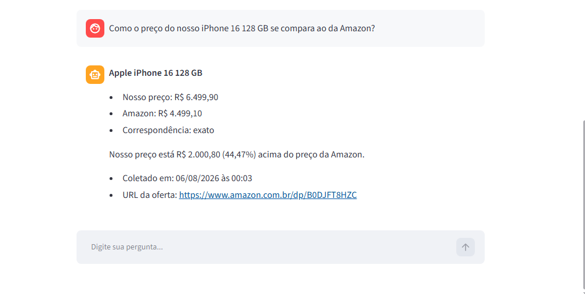
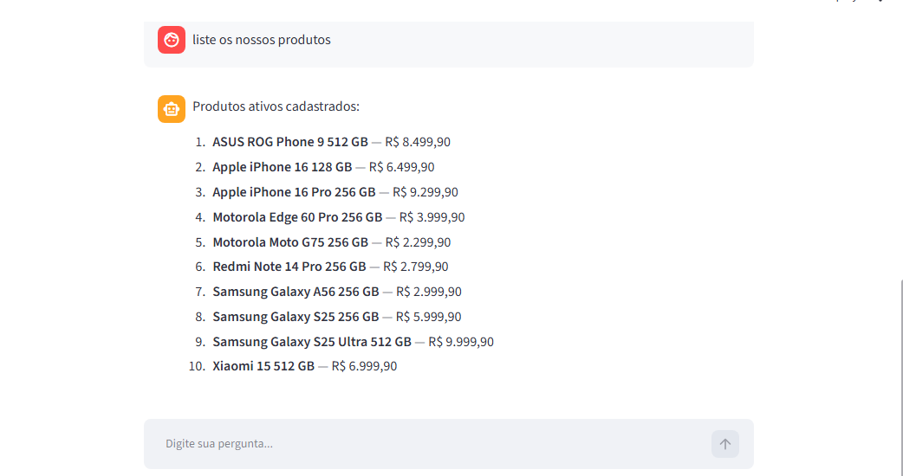

# 🤖 Secretário IA Empresarial para Apoio à Gestão Comercial

Aplicação desenvolvida em Python com deployment no Streamlit para apoiar decisões comerciais por meio de um agente de inteligência artificial. O agente utiliza LangChain para organizar a integração entre LLM, ferramentas e fluxo de execução, enquanto a Groq fornece a infraestrutura utilizada para executar o modelo de linguagem.

 O agente Secretário IA Empresarial foi desenvolvido para interpretar perguntas em linguagem natural e responder consultas relacionadas a produtos, estoque, vendas, fornecedores, compras, precificação e concorrência. Para isso, combina memória conversacional, resolução automática de contexto, roteamento inteligente, fluxos determinísticos e ferramentas especializadas, consultando bancos de dados e realizando web scraping quando necessário.

O agente responde perguntas em linguagem natural sobre:

- produtos;
- estoque;
- vendas;
- fornecedores;
- compras;
- campanhas;
- preços de concorrentes;
- risco de ruptura (falta de estoque, gargalos operacionais ou perda de vendas);
- reposição de produtos;
- redução de preços.

---

## Demonstração

<p align="center">
  
</p>

<p align="center">
  
</p>

---

## Principais funcionalidades

O agente consegue:

- consultar produtos cadastrados;
- analisar estoque atual e estoque mínimo;
- identificar produtos com risco de ruptura;
- consultar vendas recentes;
- verificar compras pendentes ou atrasadas;
- recomendar fornecedores para reposição;
- comparar preços com Amazon e Magazine Luiza;
- realizar busca e extração de preços na web;
- armazenar ofertas concorrentes no banco;
- reutilizar preços recentes por meio de cache;
- avaliar se vale a pena reduzir um preço (considerando margem de lucro);
- manter o produto e o concorrente no contexto da conversa;
- conectar informações de diferentes tabelas para responder perguntas empresariais.

### Exemplos de perguntas

```text
Qual produto apresenta maior risco de ruptura?

De qual fornecedor devemos comprar o Samsung Galaxy S25 Ultra?

Quem oferece a melhor combinação de custo e prazo?

Qual é o preço atual do iPhone 16 128 GB na Amazon?

Como esse preço se compara ao nosso?

Vale a pena reduzir nosso preço?

Compare todos os nossos produtos com produtos equivalentes
dos concorrentes.
```

---

## Arquitetura do projeto

```text
                              Usuário
                                 │
                                 ▼
                     Interface em Streamlit
                                 │
                                 ▼
                    Resolução de contexto
                (produto, concorrente e referências)
                                 │
                                 ▼
                     Roteador de intenções
                         │               │
                         │               │
                         ▼               ▼
              Fluxos determinísticos   LLM como fallback
                         │               │
                         └───────┬───────┘
                                 ▼
                    Ferramentas especializadas
        ┌────────────────┬──────────────┬─────────────────┐
        ▼                ▼              ▼                 ▼
     Estoque          Vendas         Compras         Fornecedores
        │                │              │                 │
        └────────────────┴───────┬──────┴─────────────────┘
                                 ▼
                       Regras de negócio
                                 │
                 ┌───────────────┴────────────────┐
                 ▼                                ▼
         Banco de dados                 Busca de concorrentes
          com SQLAlchemy                Tavily Search/Extract
                                                   │
                                                   ▼
                                      Validação e extração
                                      Amazon e Magazine Luiza
                                                   │
                                                   ▼
                                      Ofertas salvas no banco
```

---

## Banco de Dados

O sistema utiliza um banco SQLite (`database/empresa.db`) contendo os dados da empresa, como produtos, estoque, vendas, fornecedores, campanhas e preços de concorrentes. Essas informações servem como base para as análises realizadas pelo agente de IA. 

Durante a inicialização da aplicação, o banco é criado e populado automaticamente quando necessário, permitindo que o agente realize consultas e análises sem depender de arquivos externos, exceto quando há necessidade de fazer web scraping para obter preços de produtos de concorrentes.

SQLAlchemy é utilizado para definir os modelos do banco e realizar operações de leitura e escrita por meio de objetos Python. Assim, ele transforma operações em Python dadas pelo usuário em consultas SQL e executa no banco de dados.

## Explicação das etapas

### 1. Interface em Streamlit

O Streamlit fornece a interface de conversa utilizada pelo usuário.

A aplicação recebe a pergunta, exibe o histórico da conversa e apresenta a resposta produzida pelo agente.

### 2. Resolução de contexto

O sistema identifica entidades mencionadas na pergunta, como:

- produto;
- concorrente;
- fornecedor;
- referências a mensagens anteriores.

Exemplo:

```text
Qual é o preço do iPhone 16 na Amazon?
Como ele se compara ao nosso?
```

Na segunda pergunta, o agente reutiliza o produto e o concorrente confirmados anteriormente, graças à memória contextual.

### 3. Roteador de intenções

O roteador identifica o tipo de consulta e seleciona somente as ferramentas necessárias.

Entre as intenções reconhecidas estão:

- consulta de estoque;
- comparação de preços;
- análise de reposição;
- consulta de fornecedores;
- risco de ruptura;
- decisão de redução de preço.

### 4. Fluxos determinísticos

Consultas empresariais com regras bem definidas são direcionadas para fluxos determinísticos, que executam etapas previamente programadas em vez de depender do LLM para realizar toda a análise.

Esses fluxos podem consultar o banco de dados, combinar informações de diferentes entidades, executar cálculos e aplicar regras de negócio antes de gerar a resposta.

Por exemplo, na pergunta:

> **"Vale a pena reduzir nosso preço do iPhone 16 128 GB?"**

o sistema identifica o produto, obtém o preço interno e o preço do concorrente, considera o custo do produto e a margem mínima definida e calcula o impacto de uma possível redução de preço.

Essa abordagem torna cálculos e decisões mais previsíveis, reduz o risco de alucinações e evita que o LLM seja utilizado em tarefas que podem ser resolvidas diretamente por regras e dados do sistema.

### 5. Modelo de linguagem

O modelo de linguagem é utilizado como fallback para perguntas que não possuem um fluxo determinístico específico.

Ele recebe:

- contexto factual resumido;
- histórico reduzido;
- ferramentas selecionadas pelo roteador.

Antes de consultar o modelo, o sistema tenta resolver a solicitação utilizando regras de negócio, consultas ao banco de dados e ferramentas especializadas, produzindo respostas reproduzíveis e baseadas em dados. 

Somente quando não existe um fluxo específico capaz de responder à pergunta é que o LLM é acionado para interpretar a solicitação e decidir quais ferramentas utilizar. 

Essa abordagem híbrida reduz alucinações, diminui o custo computacional e uso desnecessário de tokens, melhora o tempo de resposta e garante maior consistência nas respostas do agente.

### 6. Ferramentas especializadas

Cada domínio da aplicação possui ferramentas específicas:

- produtos;
- estoque;
- fornecedores;
- compras;
- vendas;
- campanhas;
- concorrentes;
- análises empresariais.

As ferramentas consultam o banco e retornam resultados estruturados ao agente.

### 7. Banco de dados

O banco relacional contém tabelas relacionadas a:

- produtos;
- estoque;
- fornecedores;
- compras;
- vendas;
- campanhas;
- concorrentes;
- preços concorrentes.

O banco de dados não é o foco principal do projeto, mas fornece as informações necessárias para que o agente conecte dados e gere análises e recomendações. O acesso ao banco é realizado por meio da camada crud/, que centraliza as operações de consulta e permite que os serviços recuperem apenas os dados necessários para cada análise. Essa arquitetura também contribui para reduzir o consumo desnecessário de tokens, pois, quando o uso do LLM é necessário, apenas as informações relevantes são fornecidas ao modelo.  

### 8. Busca de preços na web

Quando não existe uma oferta recente no banco, o sistema:

1. pesquisa o produto no concorrente;
2. extrai o conteúdo da página;
3. valida marca, modelo, variante e armazenamento;
4. rejeita usados, seminovos e produtos diferentes;
5. extrai o preço publicado;
6. salva a oferta no banco;
7. reutiliza o resultado enquanto o cache estiver válido.

Atualmente são suportados:

- Amazon Brasil;
- Magazine Luiza.

---

## Estrutura do projeto

```text
challenge_alura/
│
├── agente/                     # Núcleo do agente de IA
│   ├── executor.py             # Execução do agente e fallback
│   ├── memoria.py              # Memória factual da conversa
│   ├── contexto.py             # Resolução de entidades
│   ├── roteador.py             # Seleção de intenções e ferramentas
│   ├── orquestrador.py         # Fluxos determinísticos
│   └── ferramentas/            # Ferramentas disponíveis ao agente
│
├── crud/                       # Operações de leitura no banco
│
├── database/                   # Modelos SQLAlchemy e conexão
│
├── servicos/                   # Regras de negócio e análises
│   ├── busca_precos.py
│   └── extracao_precos.py
│
├── web/                        # Busca e extração de dados externos
│   ├── tavily.py
│   └── concorrentes/
│       ├── amazon.py
│       └── magalu.py
│
├── testes/                     # Testes automatizados
│
├── assets/                     # Imagens utilizadas no README
│
├── app.py                      # Interface Streamlit
├── requirements.txt
└── README.md
```

---

## Tecnologias utilizadas

- Python
- Streamlit
- LangChain
- Groq
- SQLAlchemy
- SQLite
- Tavily Search
- Tavily Extract
- Pytest
- Regex para extração e validação de preços

---

## Como executar localmente

### 1. Clone o repositório

```bash
git clone URL_DO_REPOSITORIO
cd challenge_alura
```

### 2. Crie o ambiente virtual

```bash
python -m venv .venv
```

### 3. Ative o ambiente

Windows:

```powershell
.\.venv\Scripts\Activate.ps1
```

Linux ou macOS:

```bash
source .venv/bin/activate
```

### 4. Instale as dependências

```bash
python -m pip install -r requirements.txt
```

### 5. Configure as variáveis de ambiente

Crie um arquivo `.env`:

```env
GROQ_API_KEY=sua_chave
TAVILY_API_KEY=sua_chave
```

### 6. Execute a aplicação

```bash
streamlit run app.py
```

---

## Executar os testes

```bash
python -m pytest -q
```

---

## Limitações

- A busca de preços depende da disponibilidade dos sites concorrentes.
- Alterações na estrutura das páginas podem exigir ajustes nos extratores.
- Os preços externos possuem período de validade definido pelo cache.
- Atualmente a coleta está limitada à Amazon Brasil e ao Magazine Luiza.
- As recomendações utilizam dados históricos e devem apoiar, não substituir, a decisão humana.

---

## Próxima etapa

A próxima funcionalidade planejada é a geração de gráficos de vendas ao longo do tempo diretamente pela interface.

---
